## How to run hf spaces on local cpu (ex.intel i5 / amd ryzen 7) or by google colab with T4 gpu ❓

# Before getting into the demo, let's first understand how Hugging Face access tokens are passed from the settings on your profile ⭐

    You can see the hf token there : 👇🏻  in your profile
    
    https://huggingface.co/settings/tokens

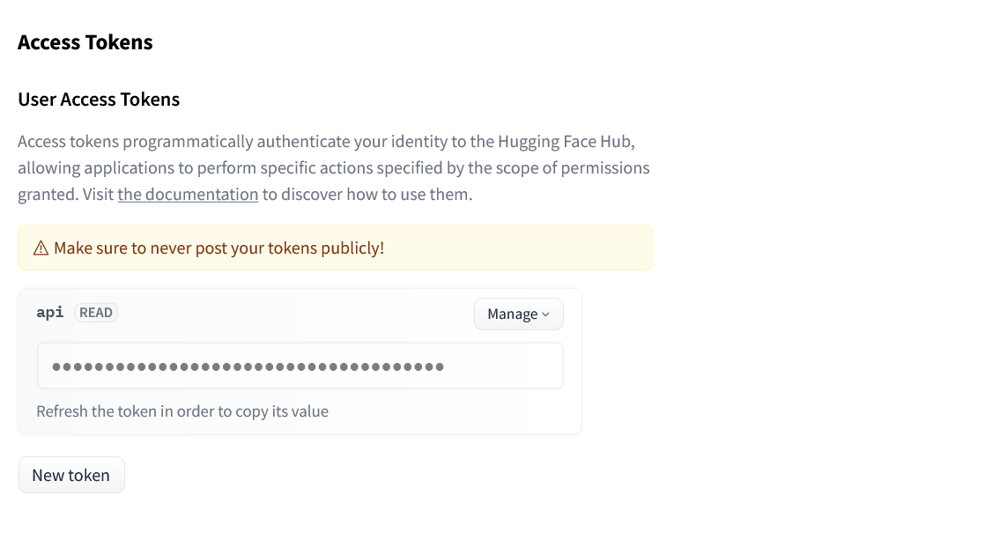

    Pass the access to Login locally to Hugging face

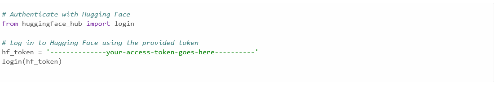

   Here we used T4 GPU Instead of Nvidia A100, where as you can access the A100 in Colab if you are a premium user. T4 is free for certain amount of computation & although it's not as powerful as the A100 or V100. Since A100 supports HCP().

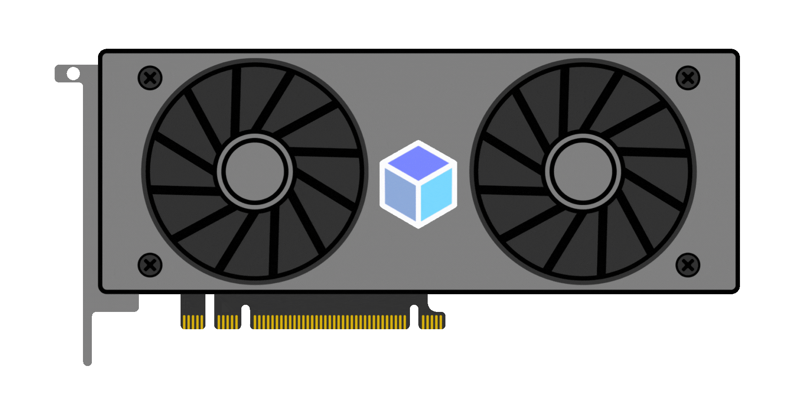

## 1. Running in T4 GPU, Google Colab Space : Hardware accelerator

    Choose the run-as-gpu.ipynb file from the repo & take it on to the colab notebooks

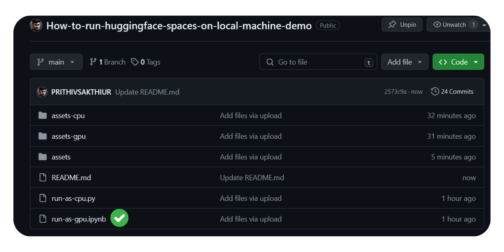

    In Colab Choose the T4 GPU as a Runtime Hardware ✅ as Google Compute Engine !!
    
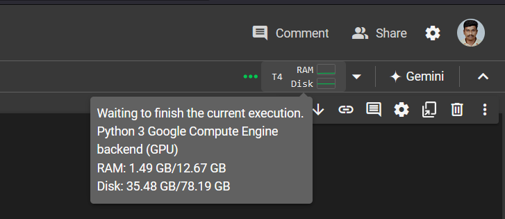

    Run the modules one by one : first the requirements, sencond the hf_access_token -- Login successful!, third the main code block. After the components of the model which you have linked with the model id will be loaded.
    
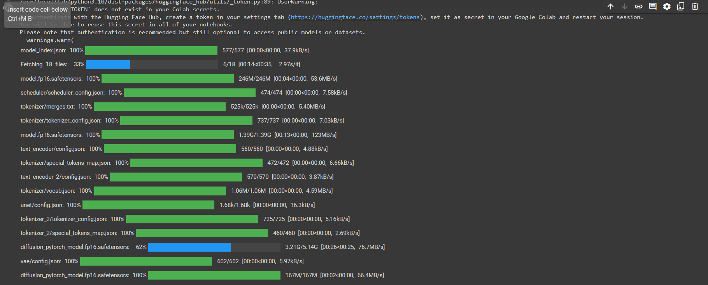

    👇🏻👇🏻After Successfully running the code the live.server for gradio will give a link like this ...

    https://7770379da2bab84efe.gradio.live/
    
🚀Progress

    After loading to the gradio.live, the gradio interface like this.. & enter the prompt and process it

| 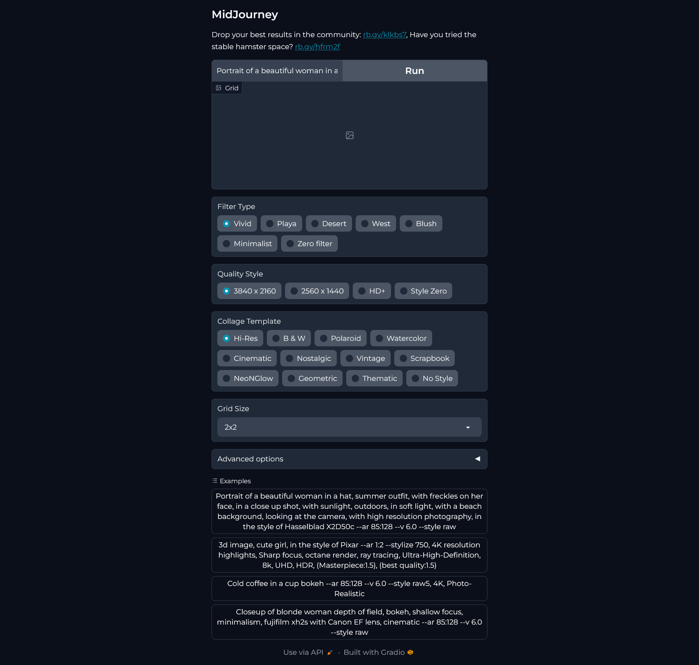 |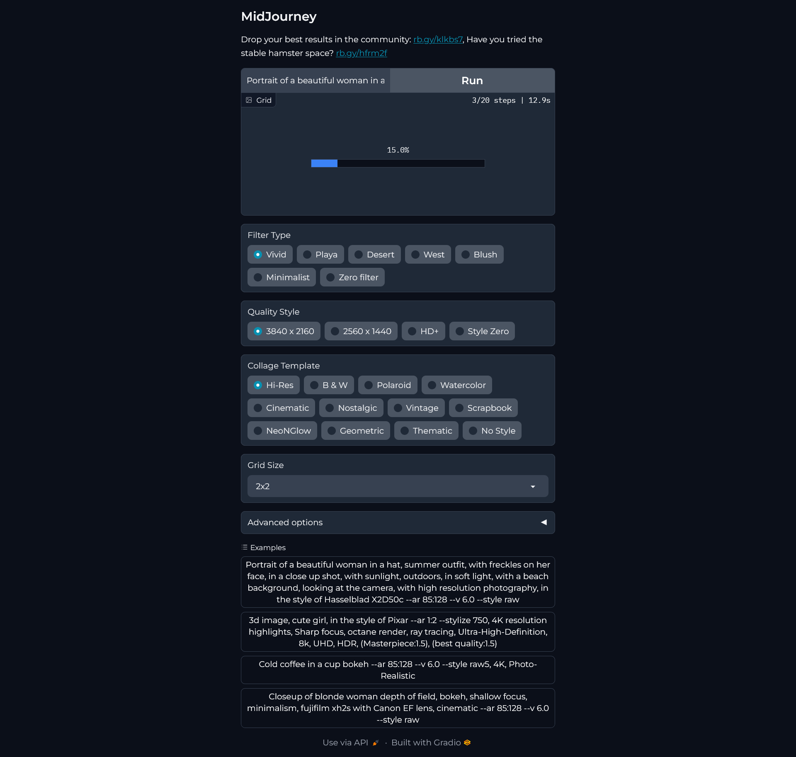 |
|---------------------------|--------------------------|

    The Sample results 1 & 2 from the colab space

| 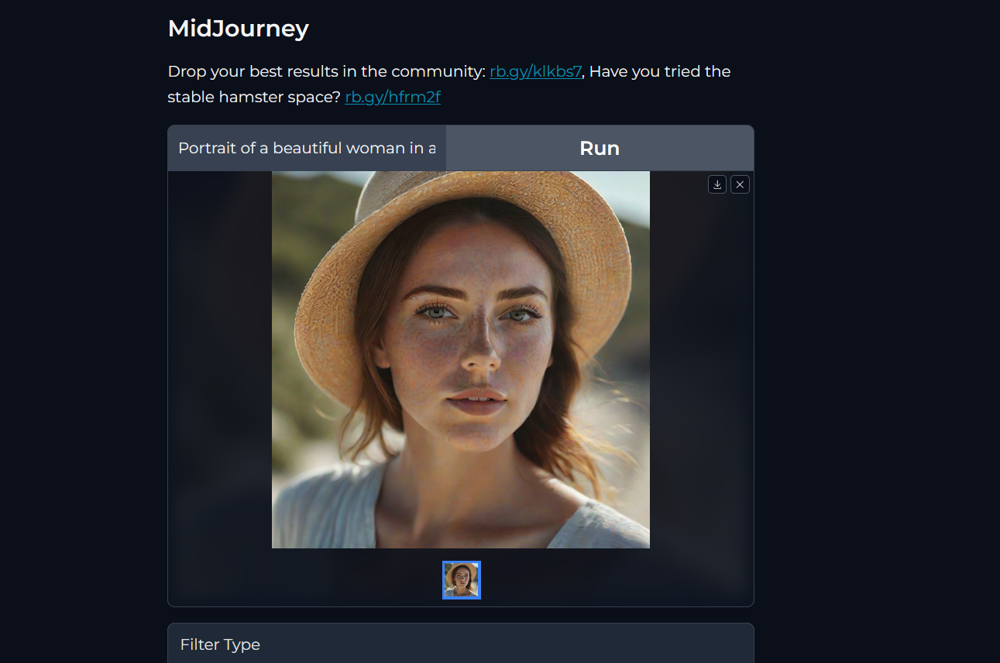 |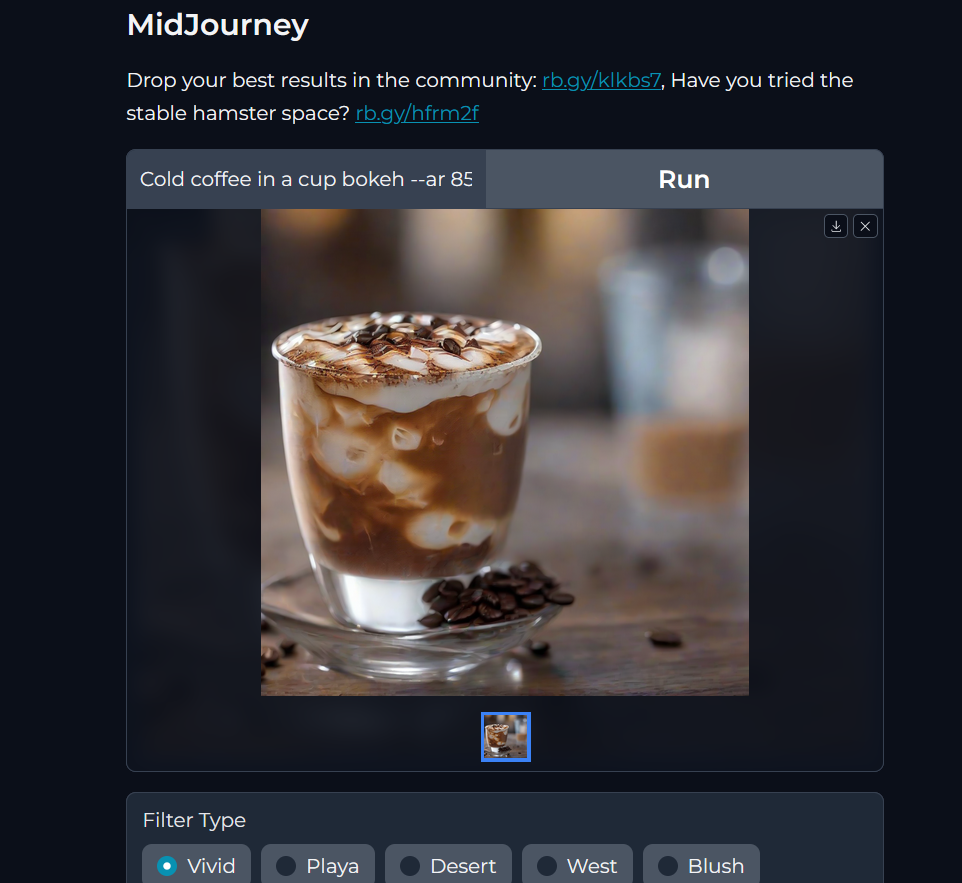 |
|---------------------------|--------------------------|

    The original resultant image from the space // gradio.live 

|  | |
|---------------------------|--------------------------|

🚀Working Link for the Colab :

    https://colab.research.google.com/drive/1rpL-UPkVpJgj5U2WXOupV0GWbBGqJ5-p

.

.

-----------------------------------------------------------------------------------------------------------------------------------------------------------------

## 2. Running in CPU, Local System : Hardware accelerator

👇🏻Same Hugging_Face Login procedure for this method also !!

    You can see the hf token there : 👇🏻  in your profile
    
    https://huggingface.co/settings/tokens

    Pass the access to Login locally to Hugging face

    Choose the run-as-cpu.py file from the repo & take it on to the local code editor ( eg. vs.code )
    Statisfy all the requirement.txt ; pip install -r requirements.txt

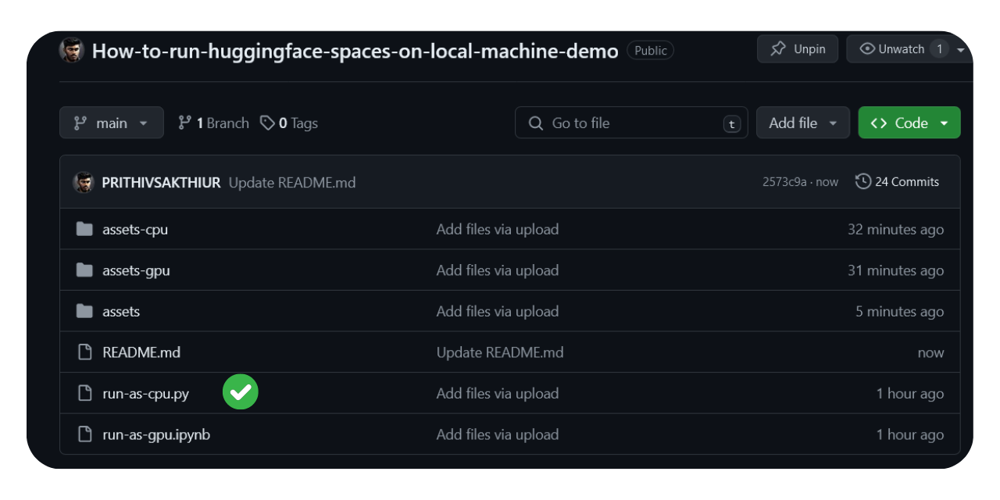
Run all the requirements

    accelerate
    diffusers
    invisible_watermark
    torch
    transformers
    xformers

🚀Run the run-as-cpu.py by ( python run-as-cpu.py )

✅ After the successful -run you will see the components loading to the local code 

    ===== Application Startup at 2024-06-17 16:51:58 =====
    The cache for model files in Transformers v4.22.0 has been updated. Migrating your old cache. This is a one-time only operation. You can interrupt this and resume the migration later on by calling `transformers.utils.move_cache()`.
    0it [00:00, ?it/s]
    0it [00:00, ?it/s]
    /usr/local/lib/python3.10/site-packages/diffusers/models/transformers/transformer_2d.py:34: FutureWarning: `Transformer2DModelOutput` is deprecated and will be removed in version 1.0.0. Importing `Transformer2DModelOutput` from `diffusers.models.transformer_2d` is deprecated and this will be removed in a future version. Please use `from diffusers.models.modeling_outputs import Transformer2DModelOutput`, instead.
      deprecate("Transformer2DModelOutput", "1.0.0", deprecation_message)
    Loading pipeline components...:   0%|          | 0/7 [00:00<?, ?it/s]
    Loading pipeline components...: 100%|██████████| 7/7 [00:00<00:00,  9.83it/s]
    Running on local URL:  http://0.0.0.0:7860
    
    To create a public link, set `share=True` in `launch()`.
    IMPORTANT: You are using gradio version 4.26.0, however version 4.29.0 is available, please upgrade.
    --------
    
      0%|          | 0/2 [00:00<?, ?it/s]
     50%|█████     | 1/2 [00:15<00:15, 15.39s/it]
    100%|██████████| 2/2 [00:29<00:00, 14.82s/it]
    100%|██████████| 2/2 [00:29<00:00, 14.91s/it]
    
      0%|          | 0/2 [00:00<?, ?it/s]
     50%|█████     | 1/2 [00:14<00:14, 14.12s/it]
    100%|██████████| 2/2 [00:29<00:00, 14.98s/it]
    100%|██████████| 2/2 [00:29<00:00, 14.85s/it]
    
      0%|          | 0/2 [00:00<?, ?it/s]
     50%|█████     | 1/2 [00:13<00:13, 14.00s/it]
    100%|██████████| 2/2 [00:29<00:00, 14.82s/it]
    100%|██████████| 2/2 [00:29<00:00, 14.70s/it]
    
      0%|          | 0/2 [00:00<?, ?it/s]
     50%|█████     | 1/2 [00:20<00:20, 20.08s/it]
    100%|██████████| 2/2 [00:40<00:00, 20.57s/it]
    100%|██████████| 2/2 [00:40<00:00, 20.49s/it]
    
      0%|          | 0/2 [00:00<?, ?it/s]
     50%|█████     | 1/2 [00:21<00:21, 21.21s/it]
    100%|██████████| 2/2 [00:43<00:00, 21.67s/it]
    100%|██████████| 2/2 [00:43<00:00, 21.60s/it]

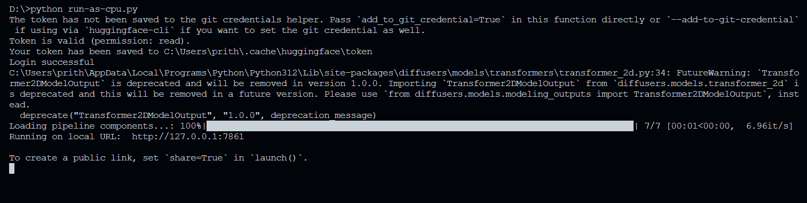

    After that you will see it launched on the ip address ( http://127.0.0.1:7861 ) to run it locally. 
    And you can launch the gradio interface in public link on your local hardware ..

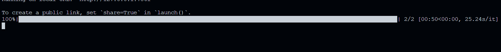

    Enter the prompt & process it on your local CPU

| 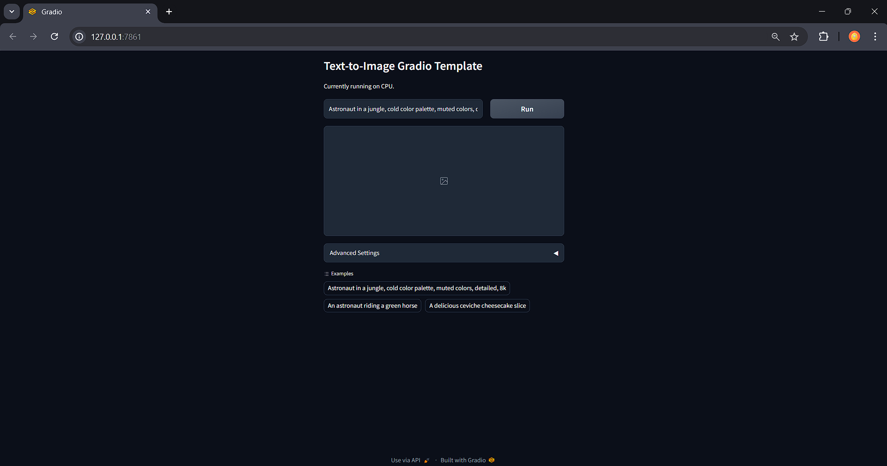 |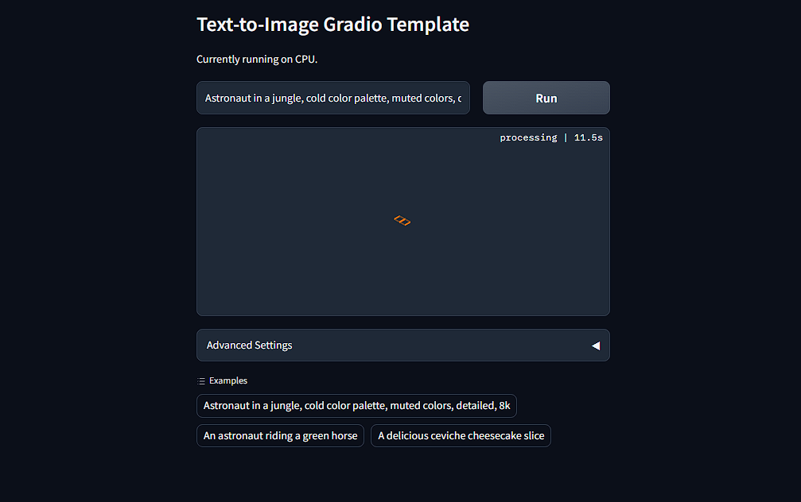 |
|---------------------------|--------------------------|

    outcome ⭐
    
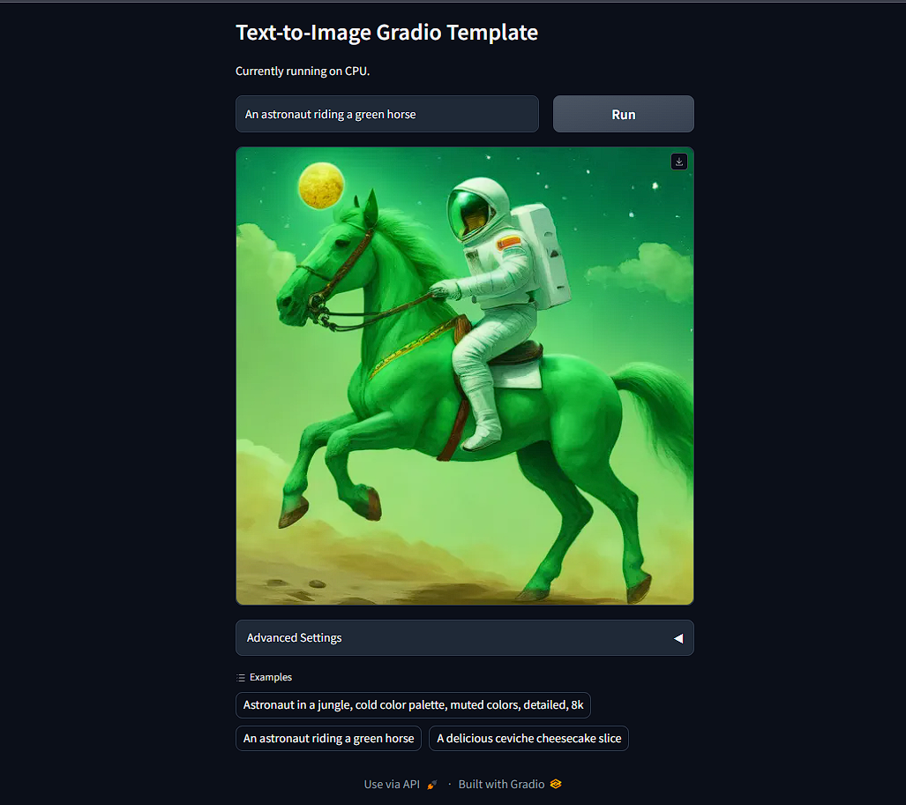

    🚀The Resultant image generated

|  | |
|---------------------------|--------------------------|

http://127.0.0.1:7861
